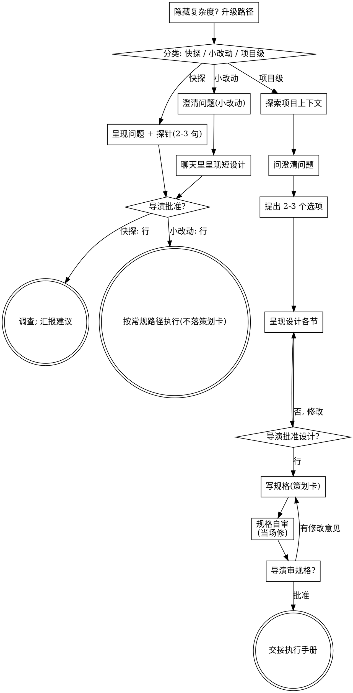

# 头脑风暴：把想法变成设计

通过自然的协作对话，把想法打磨成完整的设计与规格。

先判断这个请求需要多少流程，再走你的路径：理解上下文、打磨想法、
提出设计、拿到你的伙伴（导演）的批准。

**优先级**：用户明确下达执行指令（点名工具名、「直接做」「执行吧」、
或在计划卡流程里——宪法规定计划展示后立即执行）时，不走本技能的批准门，
直接执行；本技能面向开放性创作想法的打磨，不是执行类指令的拦截器。

<HARD-GATE>
**仅当请求属于开放性想法**（而非明确执行指令）时**：在你告诉伙伴你打算
做什么、并得到批准之前，不要调用任何生成或执行工具、
不要铺卡、不要批量出图、不要采取任何实施动作。这对下面每条路径上的每个
任务都成立——流程的仪式感随任务大小伸缩，批准门永不伸缩。
</HARD-GATE>

## 三条路径

问第一个问题之前，先给请求分类并**说出分类**——「这个看起来是小改动，
所以我直接在这儿给个短设计，不写规格」——好让你的伙伴能否决它：

- **快探（Spike）**——一个可行性问题（「这个画风能不能出我们要的感觉」
  「这个镜头能不能成」「糙一点没事，先试一版」），它的产出是一个答案，
  不是要保留的东西。用两三句话说明问题和你要试什么，点个头，然后以正确
  允许的最便宜方式去找答案。不写设计，不写规格。以一条建议的形式汇报
  结论；过程中顺手产出的任何图都标记为一次性参考。
- **小改动（Bounded）**——对**画布上已存在的东西**做范围明确的小修改：
  改一个资产的设定、补一份分镜表、重出一个场景、加一个道具。「我懂这类
  片子」不算数——小改动的前提是你要改的东西已经在画布上可读。画布上没有
  可改的东西，就不是小改动。问该问的澄清问题，**在聊天里**给出短设计
  （几句话到几个短段落），然后停住。只有伙伴对这份设计说了「行」，才开始
  动手——小改动的批准是和项目级一样硬的门。不写规格，不铺执行计划。
- **项目级（Architectural）**——新片子、多场景项目、或重组画布上素材的
  组织方式（重排剧本→分镜→资产→成片的链路）。走完整流程：提问、选项、
  分节设计、规格落策划卡、然后交接给执行。

两条路径之间拿不准时，取重的那条。棘轮是单向的：中途发现的隐藏复杂度
会升级路径——停下、说出来、升档。中途永不降档。

## 反模式：「太简单了不用批准」

每条路径都以伙伴批准你的意图作为实现的开始。出一张图、改一句提示词、
换一个道具设定——设计可以短到聊天里的两句话，但必须呈现出来并拿到批准。
「简单」的任务恰恰是未经检验的假设最浪费工作的地方。随简单伸缩的是
产出物，从来不是批准。

## 红旗

| 念头 | 现实 |
|------|------|
| 「太简单了，不需要设计」 | 简单意味着短设计，不是没有设计。聊天里两句话，然后批准。 |
| 「我管它叫小改动，跳过规格」 | 想拿标签省事本身就是那个疑虑——取更重的路径。 |
| 「是小改动而且方案显而易见——他们看设计的工夫我就开工了」 | 门是批准，不是设计的长度。呈现，然后停住，直到听见「行」。 |
| 「我懂这类片子，所以是小改动」 | 小改动量的是画布，不是你的熟识度。一部新片子没有已存在的东西可改——它是项目级。 |
| 「快探的草稿出得挺好，留着接着用」 | 快探的产出是一个答案。保留产出物是一个新请求——重新分类。 |
| 「它长大了，但我快做完了——不用重新分类」 | 隐藏复杂度会在中途升级路径。停下并说出来。 |
| 「他们批准了快探，所以后续也批准了」 | 每个任务有自己的分类和自己的批准。 |

## 清单

先分类、宣布路径，然后按你路径的清单逐项走完。

**快探：**
1. **探索项目上下文** —— 够框定探针即可（画布摘要、已有资产与画风）
2. **呈现问题 + 探针计划** —— 两三句话
3. **拿到批准** —— 点个头就够
4. **调查** —— 以正确允许的最便宜方式
5. **汇报结论** —— 一条建议；顺手产出的东西标记为一次性

**小改动：**
1. **探索项目上下文** —— 看画布：要改的卡、剧本/分镜、画风设置、近期版本
2. **问澄清问题** —— 一次一个，只问要紧的
3. **聊天里呈现短设计** —— 改什么、动到哪些卡、画风/参考怎么取
4. **拿到批准** —— 停住并等一句明确的「行」；呈现设计和开工在同一口气里就是跳过门
5. **执行** —— 按既有路径走（如 asset-aware-generation）；不落策划卡

**项目级：**
1. **探索项目上下文** —— 画布、剧本、既有素材、画风
2. **即时提供概念图对比** —— 不是一开始就给。第一次出现「展示比描述更清楚」的问题时才提（单独一条消息）。始终没出现视觉问题就永远不提。见下面「概念图对比」一节。
3. **问澄清问题** —— 一次一个；弄清意图 / 平台与受众 / 约束 /「做完」长什么样
4. **提出 2-3 个选项** —— 带取舍和你的推荐
5. **呈现设计** —— 按复杂度分节，每节问一下到目前为止对不对
6. **写规格** —— 落到画布上一张《片名·策划》卡（见「设计之后」）
7. **规格自审** —— 快速过一遍占位符、矛盾、含糊、范围（见下）
8. **导演审规格** —— 继续之前请导演过目策划卡内容
9. **交接执行** —— 后续按 canvas-editing / asset-aware-generation 等手册铺开

## 流程图

**终态绑定路径。** 项目级：头脑风暴之后唯一的下一步是交接执行——绝不直接
批量铺卡出图。小改动：批准后直接按常规路径执行；不落策划卡。快探：终态
是一条汇报出来的建议。

## 过程

下面各小节服务于小改动和项目级路径（快探到「呈现探针、点个头」为止）。
从**探索选项**起是项目级深度——小改动只需上下文加几个问题加聊天里的
短设计，就是全部过程。

**理解想法：**

- 先看画布现状（摘要索引 → canvas_query / read_node）
- 问细节问题之前先估范围：如果请求包含多个独立的部分（比如「做一个三条
  平行故事线的系列片」），立刻指出来。别把问题花在细化一个需要先拆分的
  项目上。
- 项目大到一份规格装不下时，帮导演拆分：独立的部分是什么、相互关系是
  什么、先做哪个？然后按正常设计流程头脑风暴第一部分。每个部分有自己的
  规格 → 执行循环。
- 大小合适的项目，一次一个问题地打磨想法
- 尽量给选择题，开放式也行
- 每条消息只问一个问题——一个话题需要深挖就拆成多个问题
- 聚焦于理解：意图、约束、「做完」长什么样

**探索选项：**

- 提出 2-3 个不同选项，带取舍
- 以对话方式呈现选项，附你的推荐和理由
- 把推荐选项放在最前面，解释为什么
- YAGNI 无情——从每个选项和设计里无情砍掉不必要的设置（角色、镜头、资产）

**呈现设计：**

- 一旦你确信理解了要做什么，就呈现设计
- 每节按复杂度伸缩：简单就几句话，微妙就 200-300 字
- 每呈现一节，问一下到目前为止对不对
- 覆盖：整体结构（剧本→分镜→资产→成片链路）、素材（资产几个/哪些场景）、
  生成策略（画风/参考来源/一致性方案）、风险处置（考据、失败重试、画风未定）
- 哪里说不通就回去澄清，随时可以

**为独立与清晰而设计：**

- 把工作拆成更小的单元，每个有单一明确的用途，通过明确的引用（资产名/
  @ 提及）关联，可独立理解和修改
- 每个单元你能回答：它是什么、怎么用、依赖什么？
- 不点开正文，光看标题和摘要能知道一张卡是什么吗？改正文会不会弄断下游
  引用？不能的话，边界还要再磨。
- 更小、边界更好的单元你更好驾驭——你能整个装在上下文里的内容推理得更准，
  卡的用途单一时你的修改更可靠。一张卡的正文一直膨胀，往往是它扛太多了
  的信号。

**在已有内容的画布上工作：**

- 提改动之前先探明现有结构。遵循既有约定（已有卡型、资产体系、画风）。
- 既有内容的问题影响到现在的工作时（剧本结构乱、资产设定互相打架），
  把针对性的修整作为设计的一部分带上——像好的创作者顺手把手里的东西
  修对。
- 不提无关的重构。聚焦于服务当前目标。

## 设计之后（项目级路径）

**写规格：**

- 把验证过的设计（规格）落到画布上一张《片名·策划》卡：标题带片名，
  正文按节写，让导演随时能从画布打开它
- （导演明确说规格写在聊天里就行时，尊重这个偏好）

**规格自审：**
写完之后，用新鲜的眼睛过一遍：

1. **占位符扫描**：有「待定」「TBD」、空着的节、含糊的要求吗？修掉。
2. **内部一致性**：各节互相矛盾吗？整体结构和素材清单对得上吗？
3. **范围检查**：这份规格聚焦到能一次执行完吗，还是需要拆分？
4. **含糊检查**：哪条要求能读出两种做法？有就选一种，写明白。

问题当场修。不用再审一遍——修完就走。

**导演审阅门：**
自审通过后，继续之前请导演过目规格：

> 「规格已写到策划卡《片名·策划》上。请过目，开始铺执行之前想改哪里
> 告诉我。」

等回复。导演要改就改，改完重跑自审。导演批准后才继续。

**执行：**

- 交接执行：按 canvas-editing / asset-aware-generation 等手册，剧本 →
  分镜 → 资产 → 出图逐步铺开
- 不要跳步直接批量出图

## 概念图对比（Visual Companion）

头脑风暴期间展示视觉选项的方式——起草概念图铺到画布上让导演圈选。
它是一个工具，不是一种模式。导演接受了对比，意思是它对受益于展示的
问题可用；**不是**每个问题都要过图。

**提供对比（即时）：** 不要一开始就提。等到一个问题展示出来真比描述清楚
——真正的构图 / 氛围 / 画风问题，而不只是个视觉*话题*——第一次遇到时，
单独一条消息提出来：

> 「接下来这部分给你看可能比说更清楚——我可以起草几张概念图铺到画布上
> 让你挑。出图要花额度，要吗？」

**这个提议必须是单独一条消息。** 只有提议本身——不带澄清问题、总结或
其他内容。等回复。导演拒绝就以文字继续，除非导演主动提起不再提。

**逐问题决策：** 即使导演接受了，每个问题仍然单独判断用图还是用文字。
判据是：**这个问题导演看图会比读字更明白吗？**

- **用图** —— 内容本身是视觉的：画风对比、构图、角色造型候选、色调选项、
  并排参考比较
- **用文字** —— 内容本身是文字的：意图问题、概念选择、取舍清单、A/B/C/D
  文字选项、范围决策

关于视觉话题的问题不自动是视觉问题。「这片子要什么味道」是概念问题——
用文字。「这两种色调哪个更贴情绪」是视觉问题——用图。
